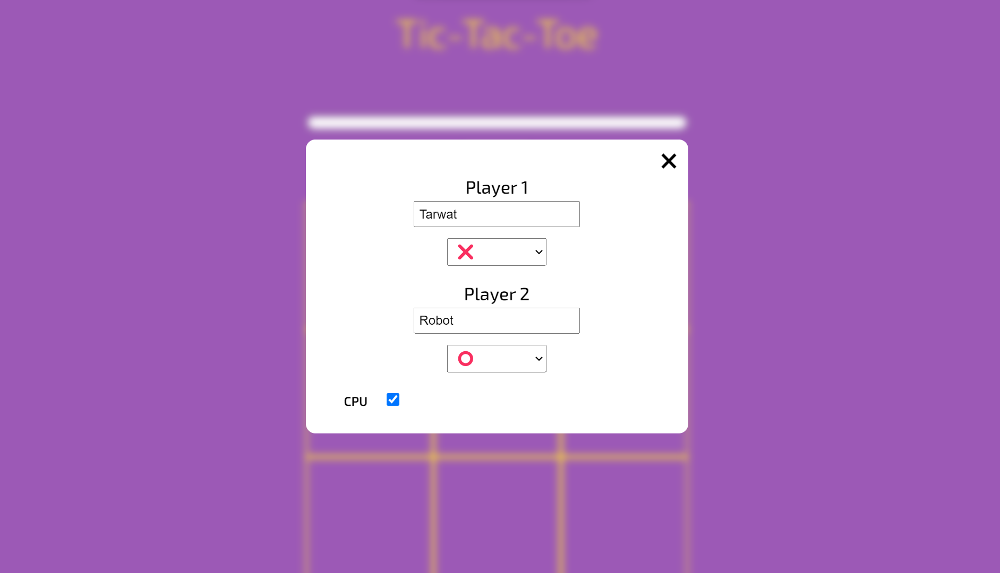
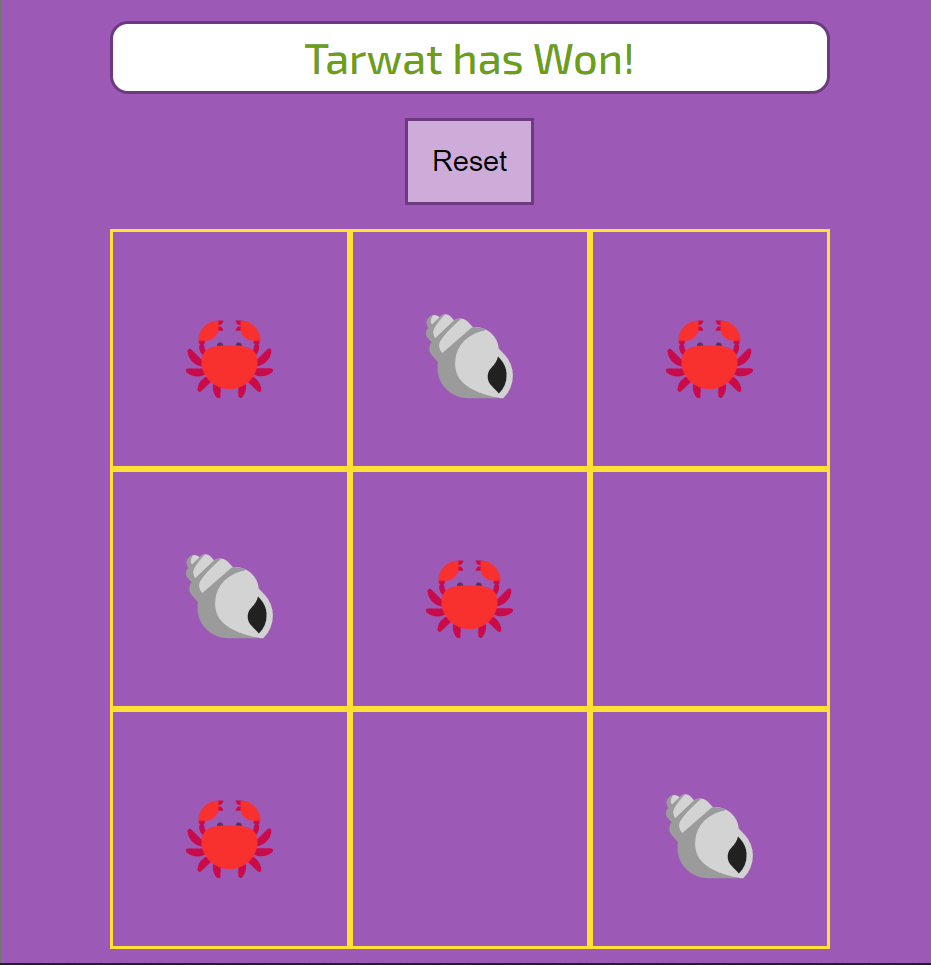

# Tick-Tack-Toe JS

## Screenshots

</img>
</img>

## Description

A JavaScript application based on the Odin Project exercise - **'Tic Tac Toe'**

**Features:**

- Modern User Interface
- Intuitive Design
- Custom Markers
- Play Against CPU

## What I've Learnt

- Advanced array manipulation

## Installation

To use this project, first clone the repo on your device using the command below:

`git init`

`https://github.com/tarwat-uddin/tick-tack-toe-js.git`

## License

[GNU General Public License version 3](https://opensource.org/licenses/GPL-3.0)
